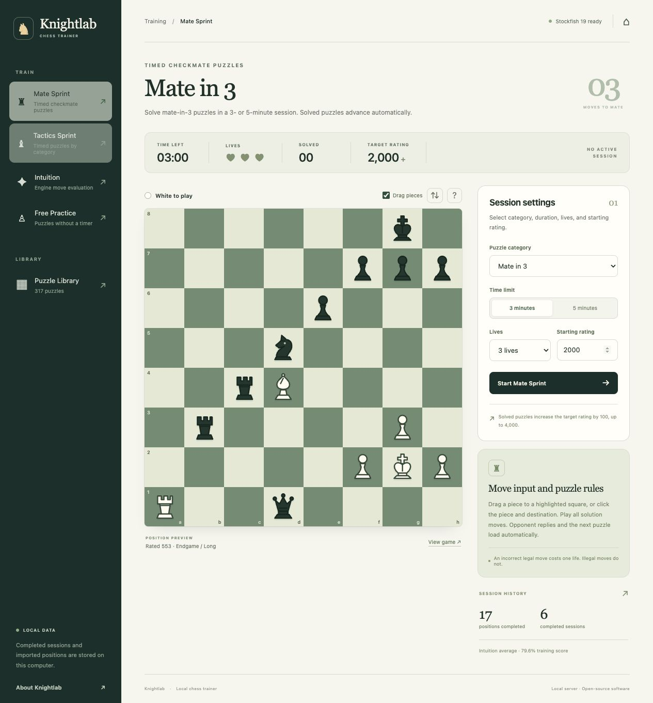

# Knightlab — Chess Trainer

A local chess training app with an English interface, real chess rules, importable puzzle libraries and Stockfish evaluation. Runs on Windows, macOS and Linux. The browser connects only to a server on your computer; no account or cloud service is required for training.



## Start locally

Requirements: **Python 3.11+**, a modern browser, and a writable project folder. The first run needs internet access to install dependencies and the official Stockfish engine. No Node.js or frontend build is needed.

### Windows 10 / 11 (64-bit)

1. Install [64-bit Python](https://www.python.org/downloads/windows/) (Python 3.13 is tested). Enable the Python launcher or **Add Python to PATH** in the installer.
2. Clone this repository or download and **extract the ZIP**. Keep the extracted folder in a location you can write to, such as Documents.
3. Double-click **`start.bat`**. It creates `.venv`, installs dependencies, downloads the correct Stockfish executable and opens **http://127.0.0.1:8765**.
4. Keep the command window open while training. **Ctrl+C** stops the local server.

The launcher also accepts a Python installation available as `python` when `py` is unavailable. Paths containing spaces are supported. It uses the virtual environment directly, so PowerShell script activation and execution-policy changes are unnecessary. If setup fails, the window stays open with the error message.

### macOS / Linux

On macOS, double-click **`Start.command`**. On Linux, run **`./start.sh`**. Both create the local environment on first run and open the same server address. Keep the terminal window open; **Ctrl+C** stops the server.

Open the server address in your browser. Opening `web/index.html` directly as a `file://` page cannot run the trainer: the board, library and engine need the local server. Direct file access shows a startup guide.

If Stockfish setup fails, puzzle modes still work; Intuition requires a working engine. You can retry with `python scripts/install_stockfish.py` using the project's virtual environment, or set `STOCKFISH_PATH` to an existing Stockfish executable.

## Training modes

- **Mate Sprint:** mate-in-two puzzles by default, three lives, three- or five-minute timer. Solved puzzles advance automatically after the final move animation; the timer and lives continue across positions. Correct solutions raise the target puzzle rating. Each run draws random positions close to the current target and avoids repeats while eligible positions remain.
- **Tactics Sprint:** the same time/life challenge with automatic progression and categories such as forks, pins and endgames.
- **Free Practice:** select a category/rating range or open a puzzle from the library. Train without time or life pressure.
- **Intuition:** positions from real games, selected for an advantage of approximately **+1.00 to +3.00 pawns for the player to move**. Play one move, see a Stockfish comparison, then proceed to a new position. A round gives individual move results and an average training score.
- **Puzzle Library:** filter by theme, rating and ID; sort by difficulty or random order; open individual puzzles and import additional packs.

The board supports click-to-move and optional drag-and-drop (the “Drag pieces” checkbox above the board, remembered locally), legal target highlighting, automatic orientation and all four promotion choices. Accepted moves animate in about 160 ms, followed by the automatic opponent reply. Castling animates both pieces. Invalid drops return to their starting square; canceled drags never submit a move. System reduced-motion preferences disable travel animations. Illegal moves do not cost a life. In a puzzle, a legal move outside the stored solution costs a life in sprint modes; the position stays available for another attempt. Opponent replies are automatic. Solve the complete line before proceeding.

## Intuition scoring

Stockfish evaluates the position and the played move from **the original player's perspective**, using the same configured analysis limit. The app compares the best root move with the user's root move; it does not accidentally reverse the evaluation after the turn changes.

```text
centipawn loss = max(0, best evaluation − played-move evaluation)
training score = 100 × exp(−centipawn loss / 200)
```

This score is a transparent training metric, not an Elo rating and not the proprietary accuracy metric of another chess service. Engine evaluations depend on search depth and time. A small loss means the engine considers the move close to best under those limits. Baseline evaluations are checked again when a position is served; positions outside the requested advantage range are skipped.

The bundled intuition positions include game links and PGN provenance. Import real games via the PGN upload to expand the pool. The import analyzes a bounded sample of positions with the local engine and retains only qualifying positions. Engine/setup errors are shown explicitly; the app never substitutes fabricated accuracy scores.

## Import puzzle libraries

Use **Puzzle Library → Import puzzles** for:

- **Lichess `.csv` / `.csv.zst`** with `PuzzleId,FEN,Moves,Rating,...,Themes,GameUrl,...` columns. Lichess FEN is before the opponent's setup move; the importer applies that first move, then stores the remaining solution. Do not apply the setup move yourself when importing the CSV.
- **JSON** containing an array of normalized puzzle records, or the same supported pack structure as the bundled fixture. For normalized JSON, FEN is already the solver's position; `moves` contains only the solution line.

Example normalized record:

```json
{
  "id": "my-unique-puzzle-id",
  "fen": "<valid six-field FEN at the solver's turn>",
  "moves": ["<legal UCI move>", "<opponent reply>", "<next solver move>"],
  "rating": 1200,
  "themes": ["mateIn2"],
  "game_url": "https://lichess.org/<game-id>",
  "source": "My puzzle pack"
}
```

Imported FENs and every move in the solution are validated. Duplicate IDs are skipped and invalid records are reported. The embedded sample library is small by design; its Lichess ratings are estimates of puzzle difficulty, not a rating of you. Fixture metadata and original sources are documented in [`data/README.md`](data/README.md).

For the **full Lichess database**, use the streaming CLI rather than the bounded browser upload:

```sh
.venv/bin/python scripts/import_library.py /path/to/lichess_db_puzzle.csv.zst
```

Windows equivalent:

```powershell
.venv\Scripts\python.exe scripts\import_library.py "C:\Puzzles\lichess_db_puzzle.csv.zst"
```

It validates and imports the file incrementally. To limit a trial import, add `--max-rows 10000`. Download the database from [Lichess's official CC0 database](https://database.lichess.org/#puzzles); downloading the complete file can require substantial disk space.

## Run from a fresh clone

Requirements: **Python 3.11+**, a modern browser, macOS / Linux / Windows. No Node.js or frontend build is needed.

```sh
python3 -m venv .venv
source .venv/bin/activate
python -m pip install -r requirements.txt
python scripts/install_stockfish.py
python -m trainer --open
```

On Windows, run these commands in PowerShell or Command Prompt (no activation required):

```powershell
py -3 -m venv .venv
.venv\Scripts\python.exe -m pip install -r requirements.txt
.venv\Scripts\python.exe scripts\install_stockfish.py
.venv\Scripts\python.exe -m trainer --open
```

If `py` is unavailable, use `python` for the first command. Alternatively, double-click `start.bat`. On Linux use `./start.sh`. A preinstalled UCI engine can be selected with the `STOCKFISH_PATH` environment variable. The setup script downloads the pinned official Stockfish 19 release and verifies the published SHA-256 checksum.

## Data and development

Puzzle imports, intuition positions and completed-session history are stored in the local **`.data/` SQLite database**. Bundled fixtures are imported into a fresh database automatically. The `.venv/`, `.runtime/` and `.data/` folders are ignored by Git. Set `CHESS_TRAINER_DATA_DIR` to use a separate data directory, for example when testing. Runtime sessions are held by the server; completed history survives restarts.

```sh
python -m pip install -r requirements-dev.txt
python -m pytest
```

GitHub Actions runs tests on Windows and Linux with Python 3.11 and 3.13, and on macOS with Python 3.13. It installs real Stockfish on every runner and also checks the Windows batch launcher. Backend tests cover legal move progression, lives, timing, filtering and import behavior. Engine tests use genuine Stockfish when installed. [`API.md`](API.md) documents the frontend/backend contract.

```text
trainer/             Python API, chess logic, SQLite, Stockfish
web/                 English UI, board and local assets
data/                Small, sourced CC0 starter library and provenance
scripts/             Launch, engine setup, full database import, demo rebuild
tests/               Backend and integration checks
```

The app binds to loopback by default and rejects cross-origin writes. This is a personal local app; it is not a multi-user hosted service. Deploying to GitHub Pages alone would not provide the Python backend or Stockfish.

## Source repository

[github.com/bsvgu/knightlab](https://github.com/bsvgu/knightlab)

```sh
git clone https://github.com/bsvgu/knightlab.git
cd knightlab
```

Source license: **GPL-3.0-or-later**. Data fixtures: **CC0**. Stockfish binaries are downloaded locally and are not checked into Git. See [`LICENSE`](LICENSE) and [`THIRD_PARTY_NOTICES.md`](THIRD_PARTY_NOTICES.md).
